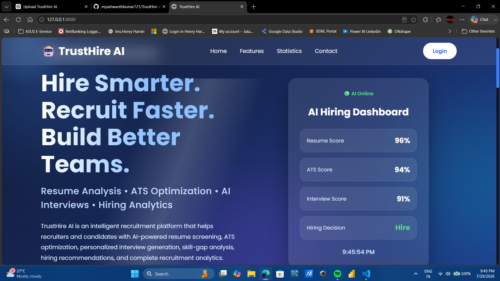
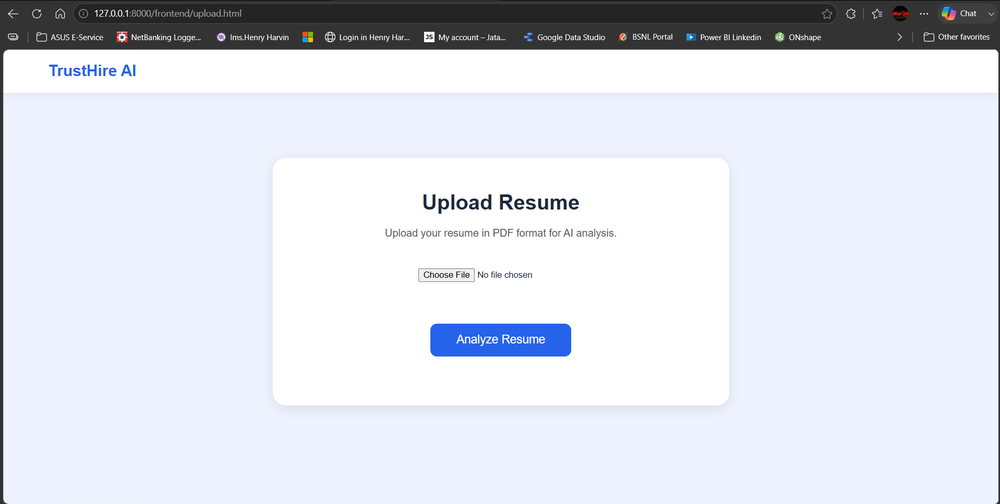
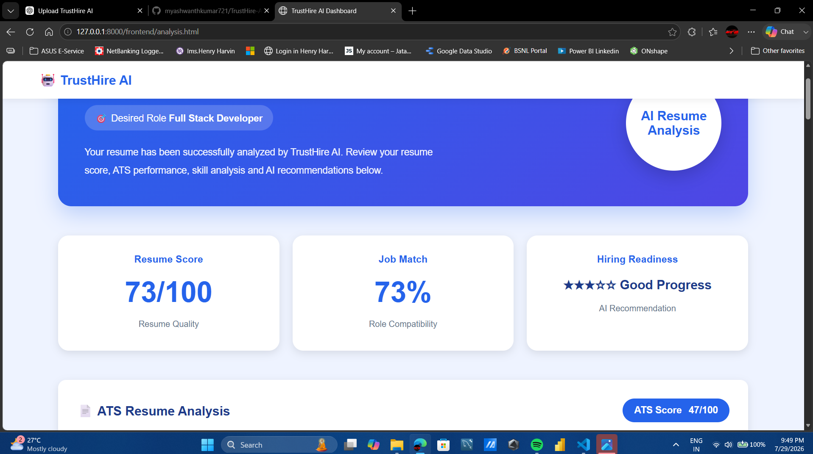
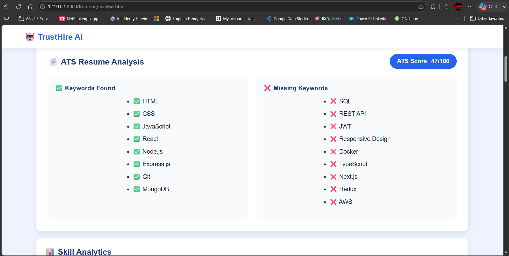
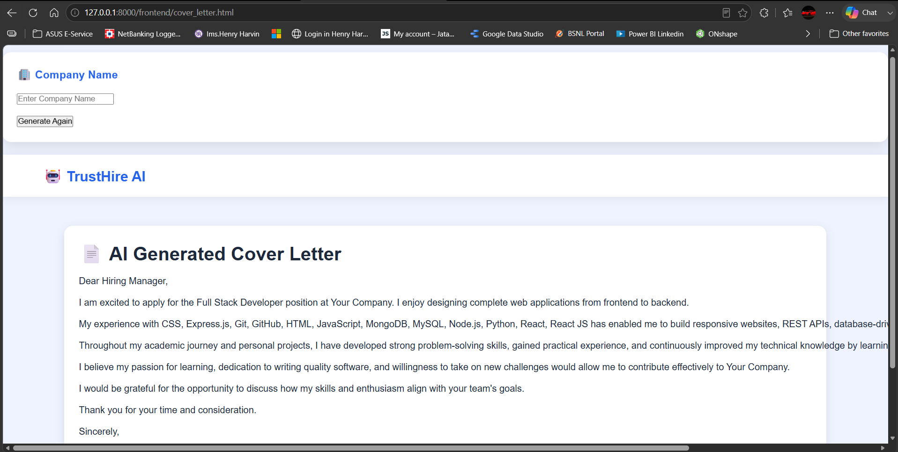
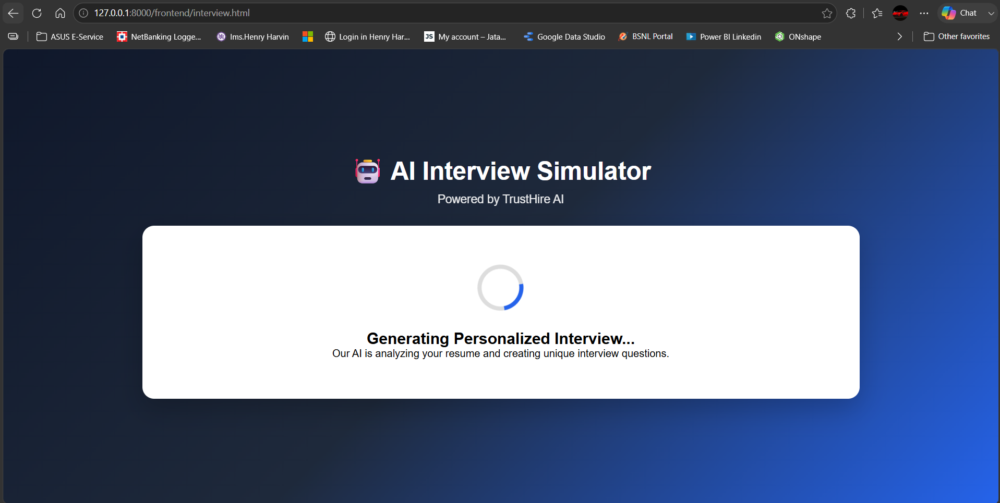
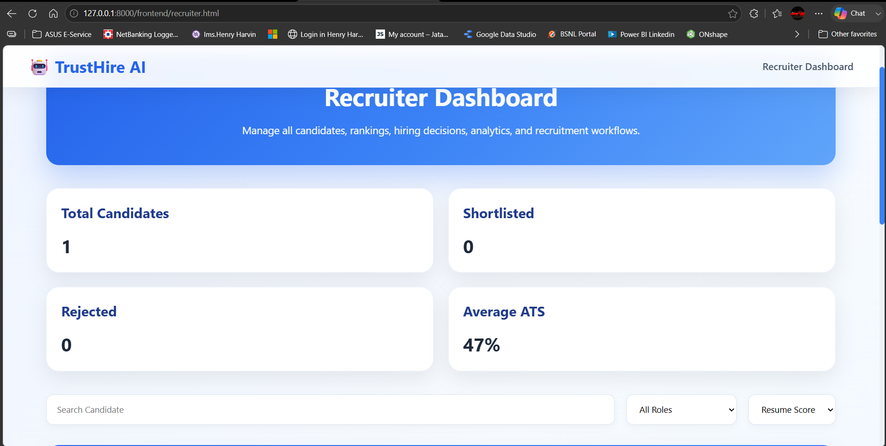

## 🚀 TrustHire AI

> AI-powered Resume Analysis and Hiring Assistant built with FastAPI and JavaScript.

---

##  Overview

TrustHire AI is an AI-powered recruitment platform that helps job seekers optimize their resumes and enables recruiters to evaluate candidates more efficiently.

It analyzes resumes, calculates ATS scores, performs role-based skill matching, generates AI-powered cover letters, simulates interviews, and produces comprehensive hiring reports through an intuitive web interface.
---

## ✨ Features

- 📄 Resume Upload
- 🤖 AI Resume Analysis
- 🎯 ATS Score Evaluation
- 💼 Role-Based Skill Matching
- 📝 AI Cover Letter Generator
- 🎤 AI Interview Simulator
- 📊 Recruiter Dashboard
- 📑 Hiring Decision Report
- 📚 Learning Resource Suggestions

---

##  Tech Stack

## Frontend
- HTML5
- CSS3
- JavaScript

## Backend
- Python
- FastAPI

## AI
- Google Gemini API

## Other
- Git
- GitHub

---

## 📂 Project Structure

```
TrustHire-AI/
│
├── backend/
│   ├── routes/
│   ├── services/
│   ├── utils/
│   └── app.py
│
├── frontend/
│   ├── css/
│   ├── js/
│   ├── assets/
│   └── *.html
│
├── uploads/
├── reports/
├── screenshots/
├── requirements.txt
├── .env.example
└── README.md
```
## 🏗 Architecture

Frontend (HTML, CSS, JavaScript)
        ↓
FastAPI Backend
        ↓
Resume Processing & AI Services
        ↓
Google Gemini API
---

##  Installation

### Clone Repository

```bash
git clone https://github.com/myashwanthkumar721/TrustHire-AI.git
```

### Open Project

```bash
cd TrustHire-AI
```

### Create Virtual Environment

```bash
python -m venv venv
```

### Activate Virtual Environment

Windows

```bash
venv\Scripts\activate
```

Linux / macOS

```bash
source venv/bin/activate
```

### Install Dependencies

```bash
pip install -r requirements.txt
```

### Configure Environment Variables

Create a `.env` file.

Example:

```env
GOOGLE_API_KEY=YOUR_GOOGLE_API_KEY
```

### Run the Application

```bash
uvicorn backend.app:app --reload
```

Open your browser:

```
http://127.0.0.1:8000
```

---


## 📸 Screenshots

### 🏠 Home


### 📄 Resume Upload


### 📊 Resume Analysis


### 🎯 ATS Score


### 📝 AI Cover Letter Generator


### 🎤 AI Interview Simulator


### 👨‍💼 Recruiter Dashboard


---

##  Future Improvements

- User Authentication
- Resume History
- Recruiter Analytics
- Cloud Deployment
- Database Integration
- Email Notifications

---

##  Contributing

Contributions, issues, and feature requests are welcome.

---

## 👨‍💻 Author

**Yashwanth Kumar M**

GitHub:
https://github.com/myashwanthkumar721

---

## ⭐ Support

If you found this project useful, consider giving it a ⭐ on GitHub.

---

## 📄 License

This project is intended for educational, portfolio, and demonstration purposes.

---

⭐ If you like this project, don't forget to star the repository!